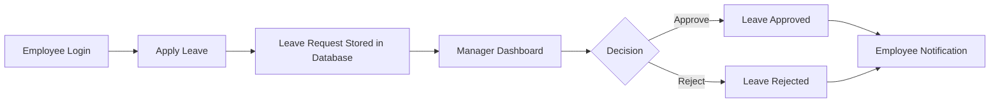
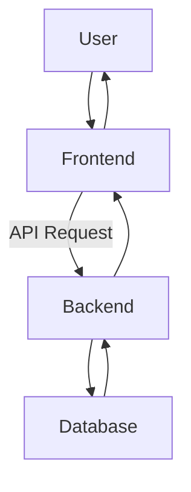

# 🚀 TimeOff Hub

### Smart Employee Leave Management System


---

# 🌟 Overview

**TimeOff Hub** is a modern **Leave Management Web Application** that allows employees to apply for leave and enables employers or managers to review, approve, or reject those requests efficiently.

The platform simplifies the leave approval workflow and improves transparency between employees and management.

This project demonstrates a **full-stack architecture** using modern technologies and follows a clean separation between **frontend, backend, and database layers**.

---

# ✨ Features

## 👨‍💼 Employee Features

* Apply for leave requests
* View leave request history
* Track leave approval status
* Simple and intuitive dashboard

## 🧑‍💻 Employer / Admin Features

* View all leave applications
* Approve or reject requests
* Manage employee leave records
* Organized leave management dashboard

---

# 🧰 Tech Stack

## Frontend

* ⚛ React.js
* 🎨 CSS / Tailwind / UI Components
* 🌐 Axios (API Requests)

## Backend

* 🟢 Node.js
* 🚂 Express.js
* 🔐 JWT Authentication

## Database

* 🍃 MongoDB

## Deployment

* ☁ Render (Backend Hosting)
* ⚡ Vercel (Frontend Hosting)
* 📦 GitHub (Version Control)

---

# 🏗 Project Architecture

```
TimeOff Hub
│
├── Frontend (React)
│     ├── Components
│     ├── Pages
│     ├── API Services
│
├── Backend (Node + Express)
│     ├── Routes
│     ├── Controllers
│     ├── Middleware
│     └── Models
│
└── Database
      └── MongoDB
```

---

# 🔁 Application Workflow



---

# 🧠 System Architecture Diagram



---

# 📂 Repository Structure

## Frontend

```
TimeOff_Hub_frontend
│
├── src
│   ├── components
│   ├── pages
│   ├── services
│   └── App.js
│
├── public
└── package.json
```

## Backend

```
TimeOff_Hub_backend
│
├── controllers
├── routes
├── models
├── middleware
├── server.js
└── package.json
```

---

# ⚙ Installation Guide

## 1️⃣ Clone the repositories

```bash
git clone https://github.com/Avani1010-prog/TimeOff_Hub_frontend
git clone https://github.com/Avani1010-prog/TimeOff_Hub_backend
```

---

# 🖥 Backend Setup

```bash
cd TimeOff_Hub_backend
npm install
npm start
```

Create a `.env` file

```
PORT=5000
MONGO_URI=your_mongodb_connection
JWT_SECRET=your_secret_key
```

---

# 🎨 Frontend Setup

```bash
cd TimeOff_Hub_frontend
npm install
npm run dev
```

Environment variable:

```
VITE_API_URL=https://timeoff-hub-backend.onrender.com
```

---

# 🌐 Deployment

## Backend Deployment

Platform: **Render**

Steps:

1. Push backend to GitHub
2. Create **Web Service**
3. Connect repository
4. Deploy with start command

```
npm start
```

---

## Frontend Deployment

Platform: **Vercel**

Steps:

1. Import GitHub repository
2. Select framework
3. Add environment variables
4. Deploy instantly

---

# 📊 API Flow Example

```
POST /api/leaves/apply
GET /api/leaves
PUT /api/leaves/:id/approve
PUT /api/leaves/:id/reject
```

---

# 🔒 Security

* JWT Authentication
* Protected API Routes
* Input validation
* Secure environment variables

---

# 🚀 Future Improvements

* Email notifications
* Role-based access control
* Leave calendar visualization
* Mobile responsive UI improvements
* HR analytics dashboard
* Slack / Email integrations

---

# 🤝 Contribution

Contributions are welcome!

Steps:

```
Fork the repo
Create a new branch
Commit your changes
Push your branch
Create a Pull Request
```

---

# 👩‍💻 Author

**Avani Pandey**

💻 Passionate about:

* Full Stack Development
* AI Systems
* Intelligent Automation

---

# ⭐ Support

If you found this project helpful:

⭐ Star the repository
🍴 Fork the project
📢 Share with others

---

# 📜 License

This project is licensed under the **MIT License**.

---

# 💡 Project Vision

**TimeOff Hub aims to simplify leave management by creating a transparent and efficient workflow between employees and employers while demonstrating a scalable full-stack system architecture.**

---
